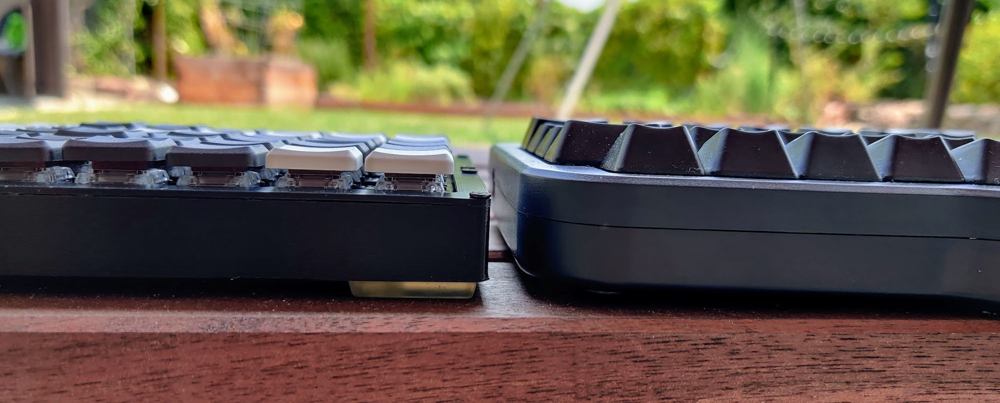

# Keebio BFO-9000 Keyboard build/layout/case

#### Why did I build this keyboard?
For context: I'm a Software Engineer, and the ideal keyboard should allow me to write code and navigate the IDE at the speed of thought.

The most crucial aspect of a good ergonomic keyboard for meis that it's split, allowing you to place the halves at width greater than your shoulder width, thus keeping your shoulders externally rotated, as opposed to internally rotated on any regular keyboard.
Over time this helps prevent rounded shoulders and promotes good posture. 

This is my third split mechanical keyboard. 
The first one was the Corne (3x6). My goal with the Corne was to create a layout that helps you keep your fingers on the home row as much as possible, by making all the home-row keys dual-function: 
A regular tap would type the letter, and a long press would trigger a modifier (alt, ctrl, cmd) or a layer change. As much as I played with the QMK settings, there was no configuration that allowed this to work smoothly for me.

My 2nd mechanical keyboard is the ErgoDox, I think it's an excellent keyboard overall, but even though it has significantly more keys, their layout is far from optimal. I was missing at least 1 (ideally 2) more columns for the right hand, and also wanted to remove some of the thumb cluster keys which I found useless, and the big keys in the inner most columns.

My daily keyboard is the Macbook Pro keyboard and I'm 100% productive with it. My goal was to build a keyboard that closely resembles this layout, doesn't make use of layers and keeps all the keys I may need immediately accessible, while, as mentioned above, keep my shoulders 
externally rotated. 

I'm planning to design a new keyboard from scratch soon, and my takeaways from working with this layout would help me make it even better.

#### Layout
The layout is very similar to my Macbook Pro keyboard, with the following main changes and design considerations:
1. Ortholinear layout obvioiusly...
2. the backslash (`\`) key removed one row down to save the need for an 8th column
3. No Caps Lock key. The backspace key is much more frequently used and is much more accessible using the pinky finger from the home row
4. Physical Function keys 🤘🏼
5. An additional functional column for the left hand
6. Tab key is also accessible on the bottom row, with a helper Cmd+Shift combo key
7. Since QMK doesn't support the Mac Fn key, I added a Ctrl+Cmd+Q key to quickly lock the computer

#### Usability

###### Colors
 * The black/white keycaps are not just for a nice look- They're meant to help you put your fingers in the right place with just a glance.
 * The 3 black rows in between the space/enter and the numeric row make it very clear where the home row is.
 * 5 white keys on each side for the numeric row make it crystal clear where each number is and also where each Function key is as they're stacked right on top.

###### Bumps
 * To navigate the keyboard without looking, There's a special bump on the `F` and `J` keys, like any other keyboards, but also on the Down Arrow key, and the `Backspace` to the right of the `A` key.
 
###### Downsides
* Some things I would change right away if I could:
  *  Make the tab/backspace/esc keys (the entire column) 2u instead of 1u. This turns out to be significant for usability
  *  Same for the space and enter key. They would've been more comfortable as 2u
  *  I would place the microcontroller on the top of the PCB on the side as opposed to underneath the swithces to make the keyboard even flatter

#### Case
Designed in Fusion 360 and printed on a Prusa i3 MK3.

Grab the `.stl` files or the original `.f3d` file and change to your needs from the [case](case) folder. 

#### Other Build Details
* PCBs from [Keebio](https://keeb.io/products/bfo-9000-keyboard-customizable-full-size-split-ortholinear)
* Elite-C v4 from [Keebio](https://keeb.io/products/elite-c-low-profile-version-usb-c-pro-micro-replacement-atmega32u4)
* Key switches from [NovelKeys](https://novelkeys.xyz/products/kailh-low-profile-switches)
* Keycaps from [Little Keyboards](https://www.littlekeyboards.com/products/mbk-choc-low-profile-keycaps) (Originally purchased in a group-buy)
* Surface-mount diodes from [Mouser](https://www.mouser.com/ProductDetail/Diodes-Incorporated/1N4148W-7-F?qs=LHX0FizJzg7Ae9ZM8LTAWw%3D%3D)
* Spacers (10mm) from AliExpress
* 2.5mm screws from Amazon

#### Height Comparison to ErgoDox EZ
One of the things I don't like about the PCB design, is that the pro-micro / Elite-C is placed underneath the switches, on the bottom side of the PCB, and next to the switches on the TOP side of the PCB. This makes the board significantly taller than it could be. Especially when using low-profile switches like I do here.

On top of that, I socketed my microcontrollers which added additional height and I ended up using 10mm spacers. With a different design I could easily shave 9mm from the final height (Leaving just 1mm-2mm spacing for the diodes and the switch legs.

Having said that, the keyboard is still significantly lower than the ErgoDox EZ, and also much smaller despite having more keys and a much more complete layout.

#### One more pic...
